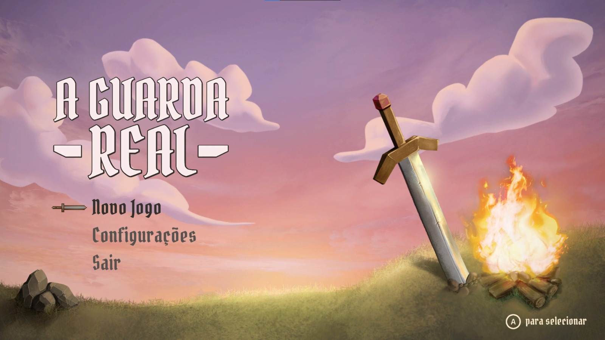
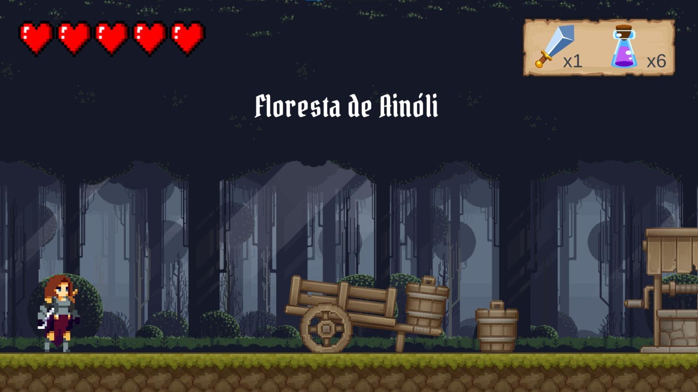
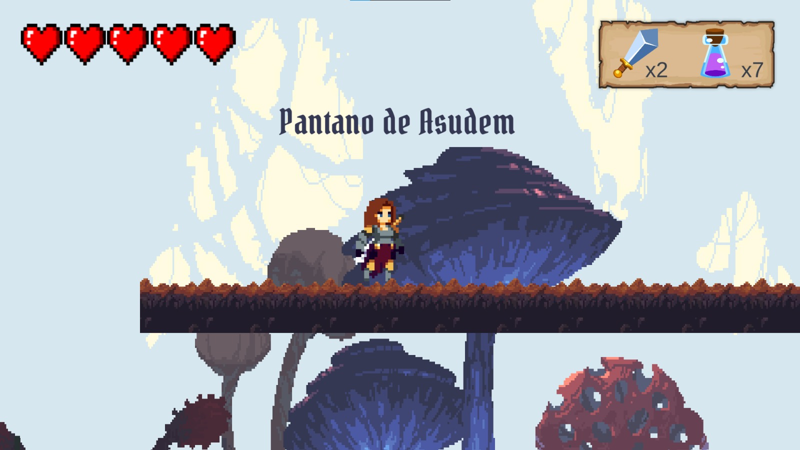
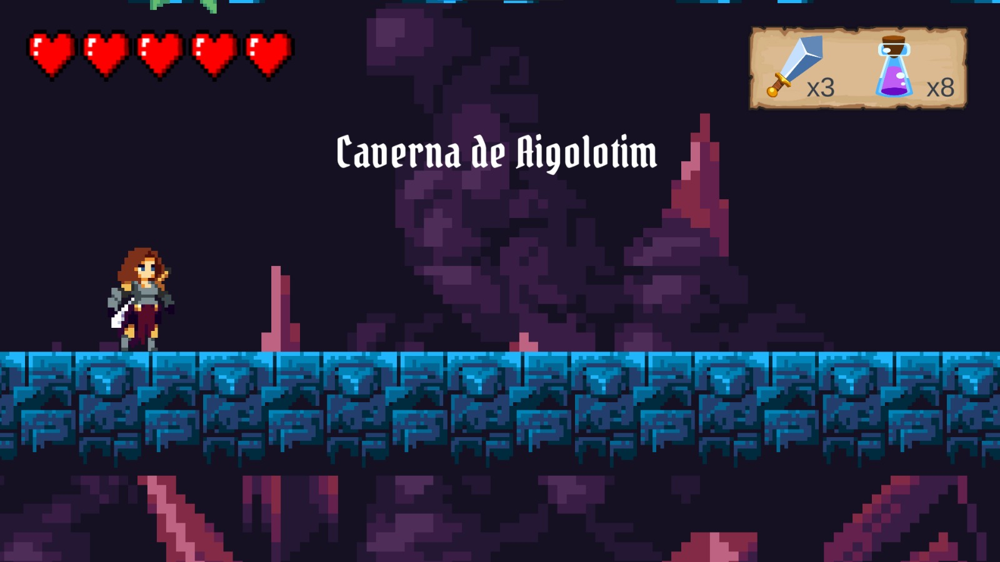
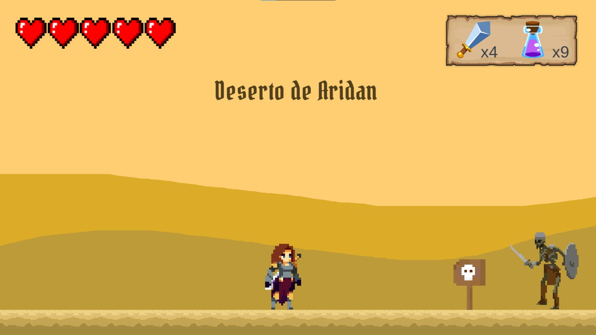
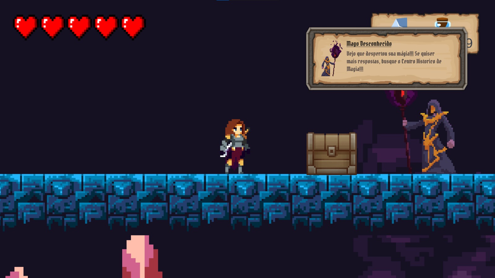
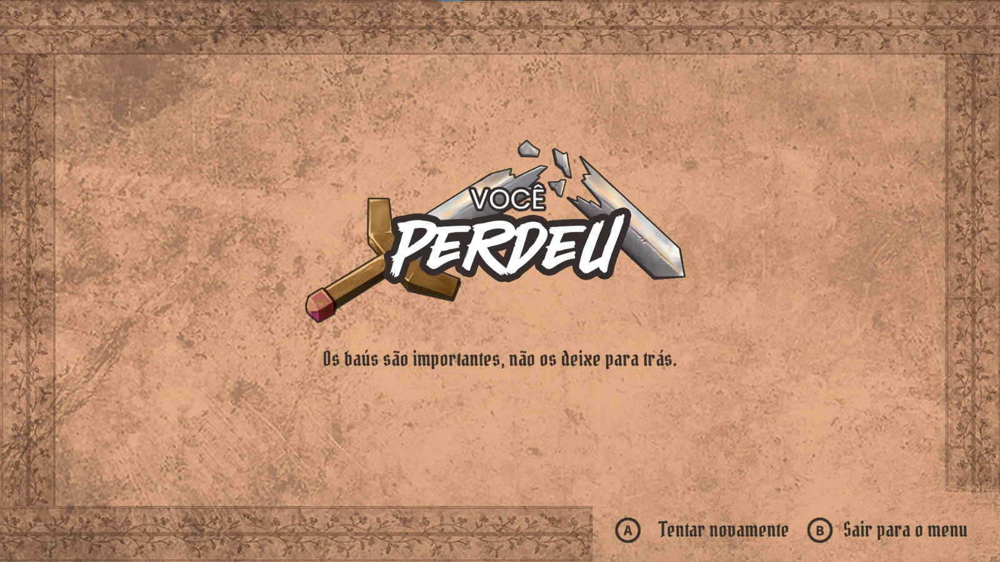
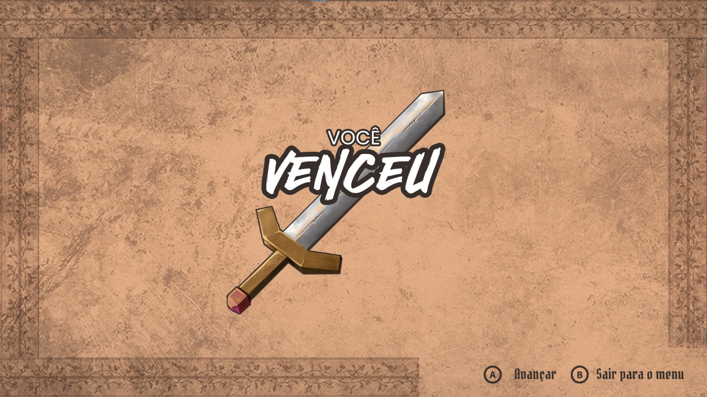
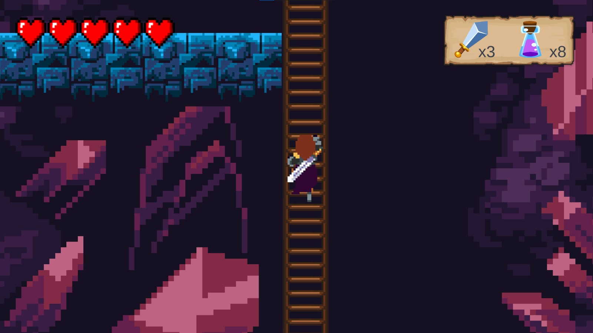
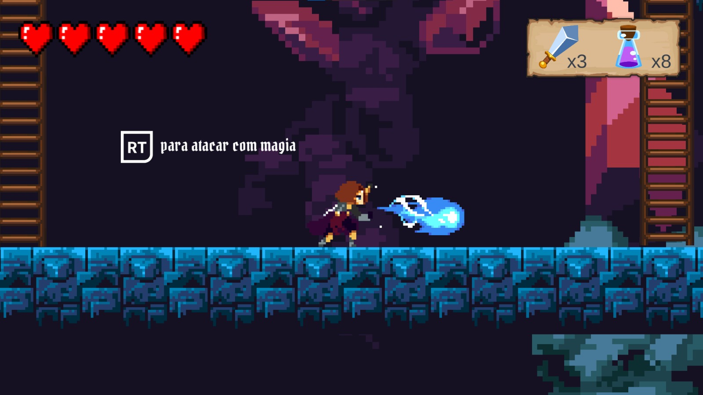

<h1 align="center"> 
	⚔ A Guarda Real ⚔
</h1>

  <a href="#-sobre-o-projeto">Sobre</a> •
  <a href="#-telas">Telas</a> •
  <a href="#-mecânicas-básicas-do-jogador">Mecânicas básicas do jogador</a> •
  <a href="#-autores">Autores</a>

## 💻 Sobre o projeto

Trabalho desenvolvido para as disciplinas de Fundamentos de Jogos Digitais e Motores de Jogos Digitais, cujo objetivo é construir um jogo de aventura e plataforma utilizando a engine Unity.
Para mais informações sobre a narrativa do jogo, acesse o [documento de game design](https://docs.google.com/document/d/1uhHRkAj-2WnMxkUVVzYRH_FLHOOsaESE/edit?usp=sharing&ouid=116738805822748469008&rtpof=true&sd=true).

---

## 🎨 Telas

  

  

  

  

  

  

  

  

---

## 🎮 Mecânicas básicas do jogador

- Movimentar-se horizontalmente (esquerda e direita);
- Pular (pulo simples e pulo duplo);
- Subir e descer escadas;

  

- Atacar:
  - Espada;
  - Magia (a partir do nível 3);
    

      
    

- Desviar de ataques inimigos:
  - Pulo duplo e pulo simples;
  - Subir e descer escadas.

💡 Foi feita a implementação de retorno tátil em combate no gamepad: Pulsação de longa duração ao ser atacado e de curta duração ao atingir o inimigo.

---

## 👥 Autores

- Bianca Mirtes: Desenvolvedora/Sonoplasta
- Fabiana Pereira: Game designer
- João Pedro Barreto: Game designer
- Samuel Costa: Desenvolvedor/Animador
