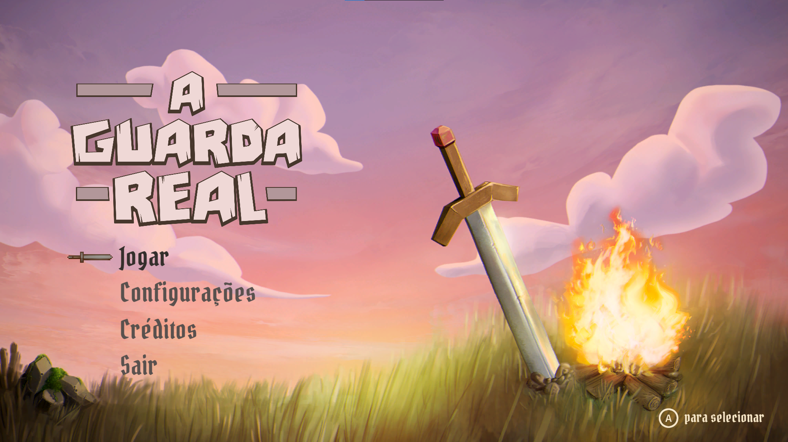
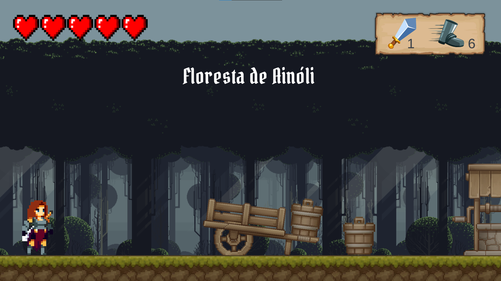
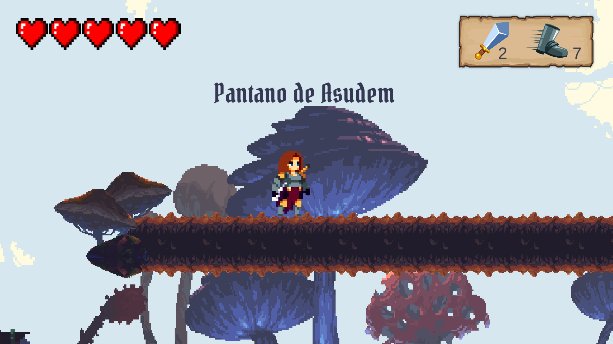
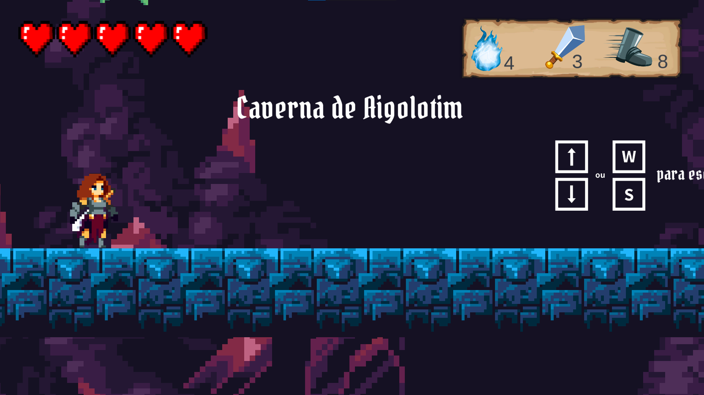
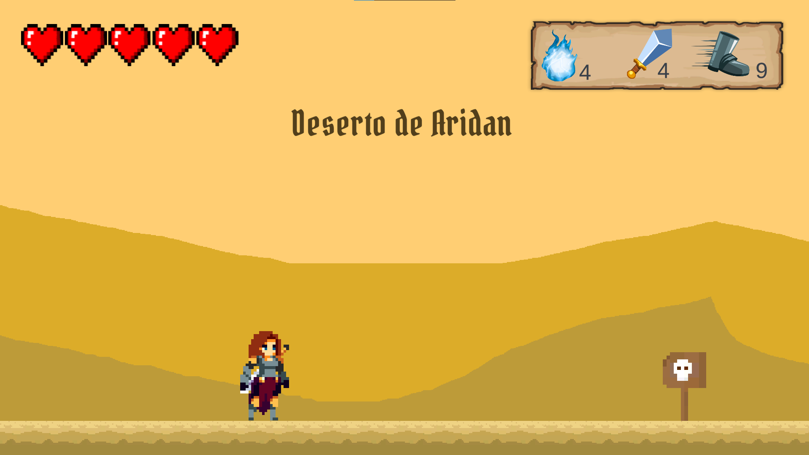
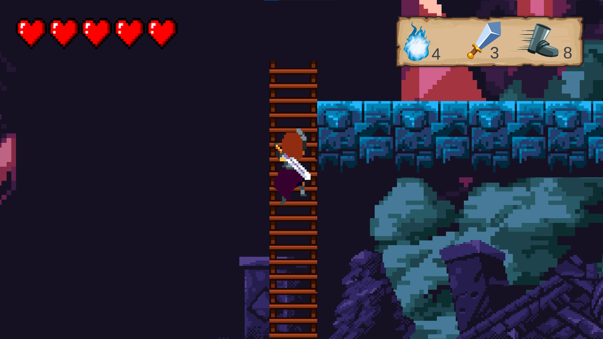
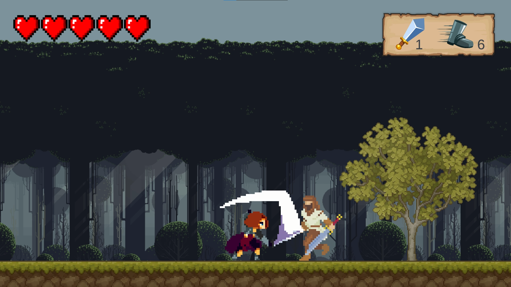
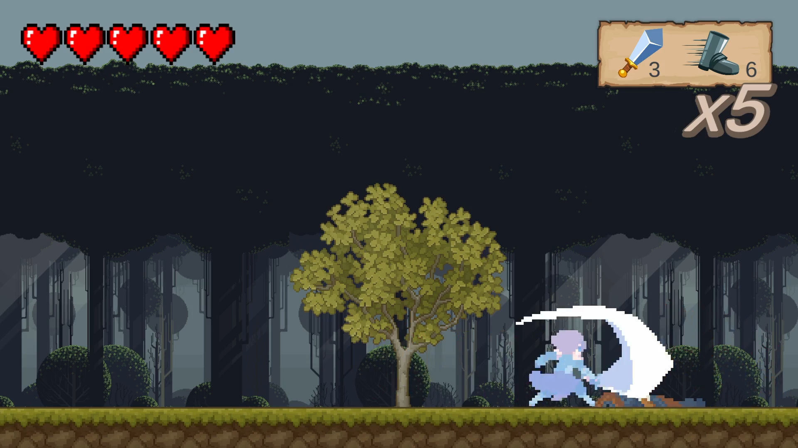
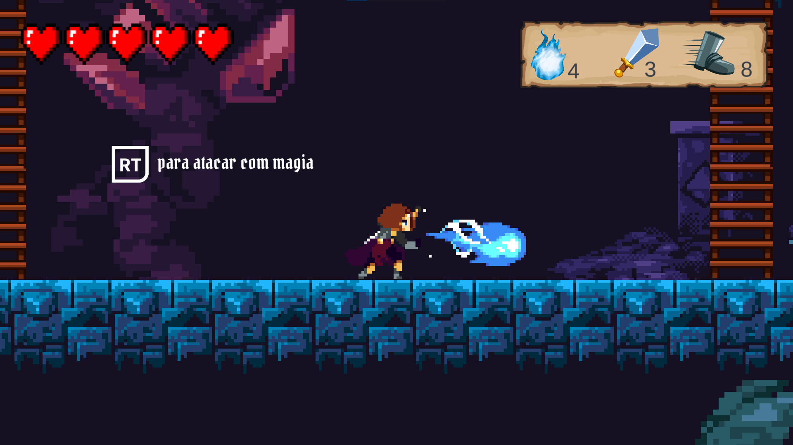

<h1 align="center"> 
	⚔ A Guarda Real ⚔
</h1>

  <a href="#-sobre-o-projeto">Sobre</a> •
  <a href="#-capturas-da-gameplay">Capturas da gameplay</a> •
  <a href="#-mecânicas-básicas-do-jogador">Mecânicas básicas do jogador</a> •
  <a href="#-controles-do-jogo">Controles do jogo</a> •
  <a href="#-autores">Autores</a>

## 💻 Sobre o projeto

Trabalho desenvolvido para as disciplinas de Fundamentos de Jogos Digitais e Motores de Jogos Digitais, cujo objetivo é construir um jogo de aventura e plataforma utilizando a engine Unity.
Para mais informações sobre a narrativa do jogo, acesse o [documento de game design](https://docs.google.com/document/d/1uhHRkAj-2WnMxkUVVzYRH_FLHOOsaESE/edit?usp=sharing&ouid=116738805822748469008&rtpof=true&sd=true).
Para ver a gameplay do jogo, acesse o [vídeo do YouTube](https://www.youtube.com/watch?v=J7tHthcbPhw).

---

## 🎨 Capturas da gameplay

  

  

  

  

  

  

  

  

---

## 🎮 Mecânicas básicas do jogador

- Movimentar-se horizontalmente (esquerda e direita);
- Pular (pulo simples e pulo duplo);
- Subir e descer escadas;

  

- Atacar:
  - Ataque físico;
    

      
    

  - Combo;
    

      
    

  - Magia (a partir do nível 3);
    

      
    

- Desviar de ataques inimigos:
  - Pulo duplo e pulo simples;
  - Subir e descer escadas.

💡 Foi feita a implementação de retorno tátil em combate no gamepad: Pulsação de longa duração ao ser atacado e de curta duração ao atingir o inimigo.

---

## 🕹 Controles do jogo

O jogo aceita entradas de teclado e mouse, bem como, entradas de gamepad.

### Entradas de teclado e mouse

**Jogo**

- Tecla ENTER avança a cutscene e diálogo (específico).
- As teclas A, D e as setas para esquerda e para direita movem o personagem horizontalmente para esquerda e direita, respectivamente.
- Tecla W, seta para cima ou barra de espaço controlam o pulo do personagem (permite pulo duplo).
- Tecla E ou clique esquerdo é para o ataque físico.
- Tecla Q para ataque mágico (liberado conforme progresso no jogo).
- Tecla O para abrir baús e interagir com itens.
- Tecla C para coletar itens.

**Menu**

- As setas para cima e para baixo controlam a opção selecionada e ENTER confirma.
- As setas para esquerda e para direita controlam o volume do áudio (apenas no menu de configurações).
- O mouse também pode ser utilizado.
- Tecla ESC para abrir menu de pause (apenas em fases jogáveis).

### Entradas de gamepad

💡 Com base em um layout de gamepad da plataforma XBOX.

**Jogo**

- Botão A avança a cutscene e um diálogo (específico). Além disso, controla o pulo do personagem (permite pulo duplo).
- O eixo analógico esquerdo move o personagem horizontalmente para esquerda e direita.
- Botão X para ataque físico.
- Botão RT para ataque mágico (liberado conforme progresso no jogo).
- Botão Y para abrir baús e interagir com itens.
- Botão B para coletar itens.

**Menu**

- O eixo analógico esquerdo controla a opção selecionada e A confirma. Além disso, controla o volume do áudio (apenas no menu de configurações).
- Nas telas de vitória e derrota, o botão A repete/avança a fase e o botão B retorna ao menu.
- Botão START abre o menu de pause (apenas em fases jogáveis).
- Botão B continua o jogo (quando pressionado no menu de pause).

---

## 👥 Autores

- Anchel Vitor Varela da Silva: Desenvolvedor
- Bianca Mirtes: Desenvolvedora/Sonoplasta
- Fabiana Pereira: Game designer
- João Pedro Barreto: Game designer
- Pablo Messias Rodrigues dos Santos: Desenvolvedor
- Samuel Costa: Desenvolvedor/Animador
